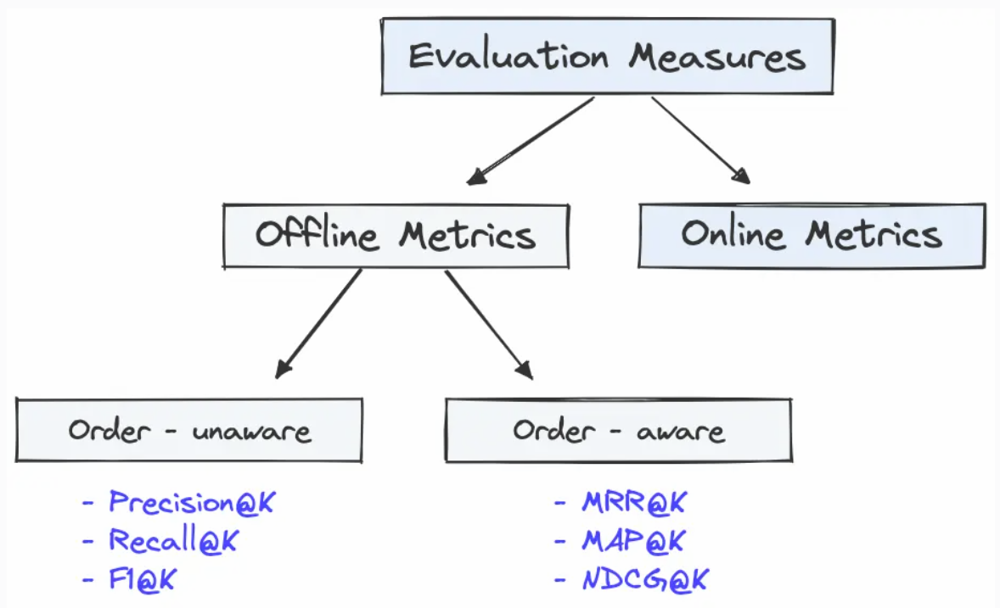

## Some thoughts:
- structured outputs
- eval
- trace
- 

## Coding style
- DRY
- SOLID
- Meaningful name
- No nested
- No magic number


## Commit convention
```csharp
<type>(<scope>)!: <short summary>

[body]

[footer(s)]
```
- Type: 
    - feat: new user-visible feature → often triggers a minor bump in SemVer tooling.

    - fix: bug fix → often patch bump.

    - docs, style, refactor, perf, test, build, ci, chore, revert: self-explanatory buckets widely used in the Angular-inspired ecosystem and enforced by commitlint.

- scope: optional area (package, module, feature), e.g. auth, parser, app/login. 

- !: mark a breaking change (either with ! or a BREAKING CHANGE: footer). 

- footer(s): structured metadata/trailers like BREAKING CHANGE: ..., Signed-off-by: ..., Co-Authored-By: ..., Refs: #123. These are parsed as Git trailers.


## Eval

### End-to-end
- Metrics
    - Answer Relevancy
    - Faithfulness
    - Context Relevancy
    - Noise sensitivity (optional)

### Component wise



- Metrics
    - Recall@k, MRR, MAP, nDCG (currently not implemented since not universally to method)

- Link for [metric reference](https://www.pinecone.io/learn/offline-evaluation/)

### Datase
- TriviaQA
    - default to not training, so use dev set to tune hyperparams, LLM-judge prompt, chunking strategy, reranker cutoff, etc
    - report the final result on test set
    - retrive chunks positive if contains alias answer, else negative
- The data schema might contains:
    - Chunk embedding
    - alias answer
    - whole page
    - question
    - other metadata
    - if going for sentence-window retrieval then sentence embedding, surrounding context, metadata
    - 

## Methodology

### Axis 1: Hybrid search vs vector search

### Axis 2: Effect of reranker (track latency)

### Axis 3: Chunking strategy
- fixed chunking
- semantic chunking


### Axis 4: Advanced retriever
- small-to-big retriver

### Axis 5: Agentic

### Axis 6: metadata filtering

## TO-DO
- [ ] implement eval pipeline
- [ ] indexing pipeline
    - [ ] Chunking
    - [ ]
- [ ] Retrieval pipeline
    - [ ] vector search
    - [ ] hybrid search
- [ ] generation pipeline
    
